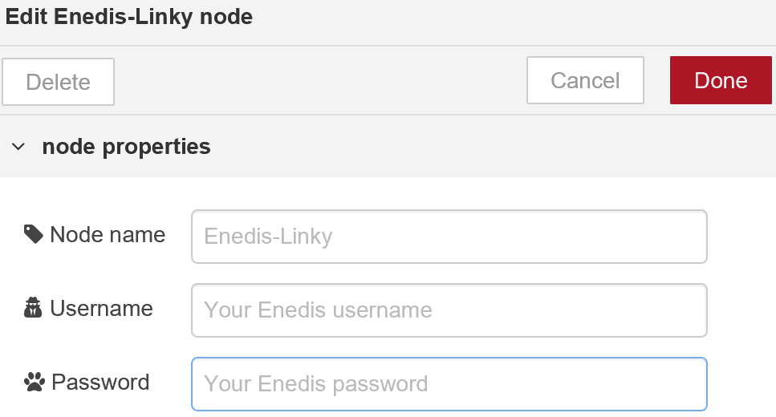

### _A simple node to connect to a **ENEDIS** (French electrical distribution network) account to fetch your own energy consumption provided by the Linky smart meter and use it as you wish..._

<p align="center"></p>

***
### Module (node) Node-Red permettant de récupérer sur le site **_ENEDIS_** vos données de consommation électrique collectées par le compteur **_Linky_**.

***

## ★ Installation

1. Télécharger, extraire puis copier le repertoire **Linky** dans le dossier `\node_modules\` concerné par votre éditeur **_NODE-RED_**.

3. Relancez et/ou actualisez l'onglet de votre explorateur.

***

## ★ Compte ENEDIS

Afin de pouvoir collecter vos données de consommation issues de votre fournisseur d'éléctricité, il convient de :

### Créer un compte

- Suivez la procédure : ["Création de mon compte"](https://espace-client-particuliers.enedis.fr/web/espace-particuliers/creation-de-compte).

    Aprés avoir renseigné vos données personnelles, vous recevrez soit un lien pour activer votre compte immédiatement, soit un mot de passe par courrier...

- Suivez le lien qui vous a été communiqué et saisissez vos identifiants et mot de passe dans le formulaire.

    >_Comptez environ 3 à 4 semaines aprés l'installation de votre compteur **_Linky_** avant d'avoir vos données accessibles en ligne..._ :hushed:

### Activer votre compte

- Connectez-vous sur votre ["Espace client"](https://espace-client-particuliers.enedis.fr/group/espace-particuliers/).

    Activez votre _*courbe de charge*_ (l'accord pour la collecte de vos données de consommation électrique toutes les 1/2 heures) si vous le souhaitez.

    Onglet "Consommation" ➜ "Gérer ma courbe de charge" ➜ "Activer ma courbe de charge" 

    >_Si la courbe de charge n'est pas activée (désactivable à tout moment), le module _**Linky**_ ne pourra vous transmettre les demandes de données "Journalières", mais les autres demandes seront considérées._

***

## ★ Configuration du module 

- Double-cliquez sur le node  pour en ouvrir l'éditeur des propriétés...

    <p align="center"></p>

- Renseigner les champs correspondants à vos codes utilisés sur le site **_ENEDIS_**.

    <code>Username</code> ➜ Adresse e-mail.
    
    <code>Password</code> ➜ Mot de passe.

    >#### _Pour assurer la confidentialité, les champs ci-dessus possédent la propriété NODE-RED `credentials`._
    >- _Stockage de leur valeurs hors du fichier principal du "flow"._
    >- _Ne sont pas inclus en cas d'exportation des "flows" en dehors de l'éditeur._

***

## ★ Fonctionnement

### Inputs

En entrée, le module demande uniquement et simplement un message comprenant les dates de début et de fin du relevé de consommation que vous souhaitez obtenir en retour.

#### Format du message `msg` en entrée

``` json
msg {
    "topic" : "linky",
    "payload" : {
        "debut": "JJ-MM-AAAA",
        "fin": "JJ-MM-AAAA"
    }
}
```

`msg.topic` {string} (facultatif)

- Valeur ➜ `"linky"` permettant éventuellement de publier sur un `topic` ou de tester la validité du message.

`msg.payload` {JSON}

- `msg.payload.début` {date} ➜ Date de début du relevé demandé.
- `msg.payload.fin` {date} ➜ Date de fin du relevé demandé.

>_Formats {date} acceptés = `"JJ-MM-AAAA"` ou `"JJ/MM/AAAA"`_

### Outputs

Aprés l'envoi de la requète sur le site **_ENEDIS_**, le module retourne le message d'entrée surchargé des données demandées.

#### Format du message `msg` en sortie

``` json
msg {
    "topic": "linky",
    "payload": {
        "..." : {"..."},
        "linky": {"your_JSON_datas"}
    }
}
```
`msg.topic` {string}

- Ajout systématique de la propriété `topic` 
- Valeur ➜ `"linky"`

`msg.payload` {object}
- Conservation des données présentes en entrée.

`msg.payload.linky` {JSON}
- Ajout de la propriété `linky`
- Valeur ➜ Objet représentant les valeurs demandées.

***

## ★ Utilisation

_**ENEDIS**_ propose 4 possibilités de consultation de vos données listées sur la page dédiée au ["suivi de consommation"](https://espace-client-particuliers.enedis.fr/group/espace-particuliers/suivi-de-consommation).

- _**Par heure**_
    - Toutes les 1/2h durant 24 heures et par jour calendaire.
- _**Par jour**_
    - Entre 2 dates séparées de 1 à 31 jours maxi.
- _**Par mois**_
    - Compris entre 2 et 12 mois.
- _**Par an**_
    - Indisponible car moins d'un an d'installation.

>Le module selectionnera la requête adaptée aux dates que vous aurez passées et de ce fait minimise les risques d'erreurs. 

- _**Exemples de requêtes**_

    | Date début | Date Fin   | Requête  | Remarques        | Payload |
    |:----------:|:----------:|:---------|:-----------------|:-------:|
    | 01-01-2018 | 01-01-2018 | Par heure| Dates identiques |`{"debut": "01-01-2018, "fin": "01-01-2018"}`|
    | 10-02-2018 | 11-02-2018 | Par jour | Durée = 1 jour   |`{"debut": "10-02-2018, "fin": "11-02-2018"}`|
    | 05-03-2018 | 04-04-2018 | Par Jour | Durée = 31 jours |`{"debut": "05-03-2018, "fin": "04-04-2018"}`|
    | 05-03-2018 | 05-04-2018 | Par mois | Durée > 31 jours |`{"debut": "05-03-2018, "fin": "05-03-2018"}`|
    | 10-10-2017 | 20-03-2018 | Par mois | D'octobre à mars |`{"debut": "10-10-2018, "fin": "20-03-2018"}`|
    | 01-02-2017 | 28-02-2018 | Par mois | Durée 12 mois    |`{"debut": "01-02-2017, "fin": "28-02-2018"}`|

***

## ★ Compatibilité

***

## ★ Restrictions

***

## ★ License

Logiciel libre sous [licence MIT](https://github.com/PhilBri/Node-Linky/blob/master/LICENSE)
