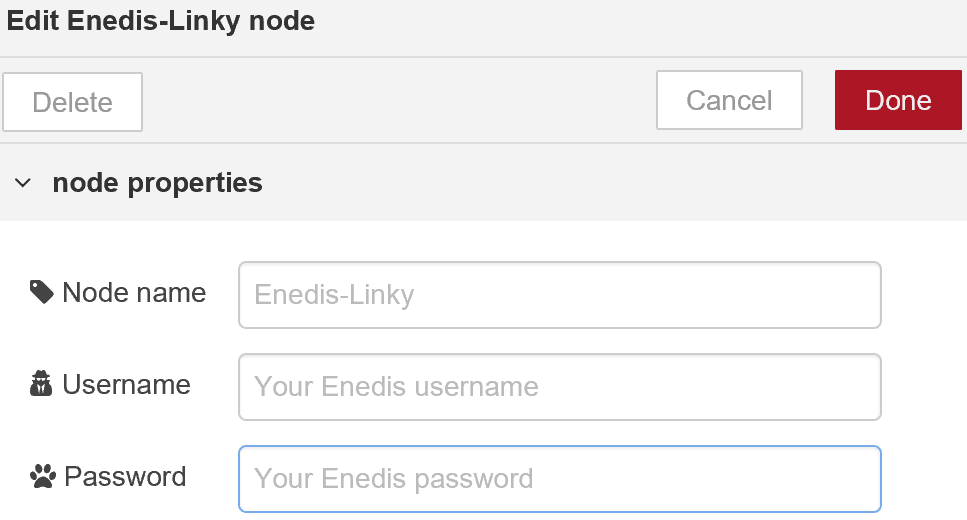

<p align="center"></p>

> ### Module (node) Node-Red permettant de récupérer les données de consommation du compteur Enedis-Linky.

## ★ Installation

1. Télécharger, extraire puis copier le repertoire **Linky** dans le dossier `\node_modules\` concerné par votre éditeur **_NODE-RED_**.

3. Relancez et/ou actualisez l'onglet de votre explorateur.

## ★ Compte ENEDIS

Afin de pouvoir collecter vos données de consommation issues de votre fournisseur d'éléctricité, il convient de :

### Créer un compte

- Suivez la procédure : ["Création de mon compte"](https://espace-client-particuliers.enedis.fr/web/espace-particuliers/creation-de-compte).

    Aprés avoir renseigné vos données personnelles, vous recevrez soit un lien pour activer votre compte immédiatement, soit un mot de passe par courrier...

- Suivez le lien qui vous a été communiqué et saisissez vos identifiants et mot de passe dans le formulaire.

    >Comptez environ 3 à 4 semaines aprés l'installation de votre compteur **_Linky_** avant d'avoir vos données accessibles en ligne...

### Activer votre compte :

- Connectez-vous sur votre ["espace client"](https://espace-client-particuliers.enedis.fr/group/espace-particuliers/).

    Activez votre _*courbe de charge*_ (l'accord pour la collecte de vos données de consommation élèctrique toutes les 1/2 heures) si vous le souhaitez.

    Onglet "Consommation" ➜ "Gérer ma courbe de charge" ➜ "Activer ma courbe de charge" 

    >Si la courbe de charge n'est pas activée (désactivable à tout moment), le module _**Linky**_ ne pourra vous transmettre les demandes de données "Journalières", mais les autres demandes seront considérées.
 
## ★ Configuration du module 

- Double-cliquez sur le node  pour en ouvrir l'éditeur...

    

- Renseigner les champs :

    - <code>Username</code> :
    - <code>Password</code> :

    Correspondants à vos codes utilisés sur le site **_ENEDIS_**.


    >Pour assurer la confidentialité, les champs ci-dessus possédent la propriété NODE-RED `credentials`:
    >- Stockage des valeurs hors du fichier du "flow" principal.
    >- Ne sont pas inclus en cas d'exportation des "flows" en dehors de l'éditeur.

## ★ Fonctionnement

### Inputs

En entrée, le module demande uniquement et simplement de lui fournir les dates de début et de fin du relevé que vous souhaitez obtenir en retour.

#### Format du message `msg` en entrée

``` json
msg {
    "topic" : "linky",
    "payload" : {
        "debut": "JJ-MM-AAAA",
        "fin": "JJ-MM-AAAA"
    }
}
```

`msg.topic` {string} (facultatif)

- Valeur ➜ `"linky"` permettant éventuellement de publier sur un `topic` ou de tester la validité du message.


`msg.payload` {JSON}

- `msg.payload.début` {date} ➜ Date de début du relevé demandé.
- `msg.payload.fin` {date} ➜ Date de fin du relevé demandé.


>Format {date} accepté = `"JJ-MM-AAAA"` ou `"JJ/MM/AAAA"`

### Outputs

Aprés l'envoi de la requète sur le site **_ENEDIS_**, le module renvoie (en sortie) les données demandées.

#### Format du message `msg` en sortie

``` json
msg {
    "topic": "linky",
    "payload": {
        "..." : {...},
        "linky": {object}
    }
}
```
`msg.topic` {string}

- Ajout systématique de la propriété `topic` 
- Valeur ➜ `"linky"`

`msg.payload` {object}
- Conservation des données présentes en entrée.

`msg.payload.linky` {JSON}
- Ajout de la propriété `linky`
- Valeur ➜ Objet représentant les valeurs demandées.

## ★ Utilisation

  - Exemples :


## ★ Compatibilité

## ★ Restrictions


## ★ License

Logiciel libre sous [licence MIT](https://github.com/PhilBri/SARAH-V5-Livebox/blob/master/LICENSE)
